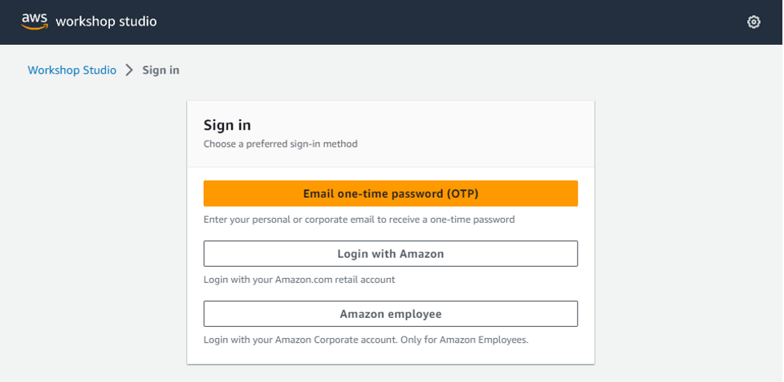
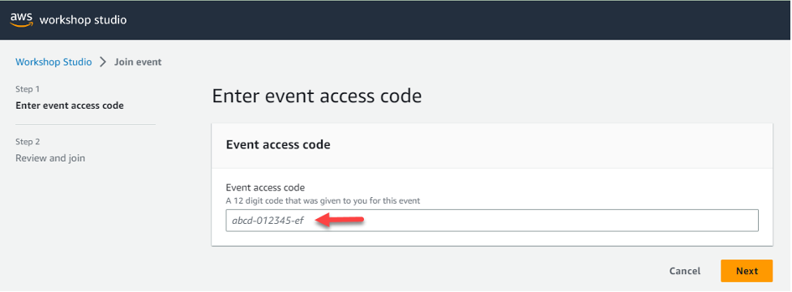
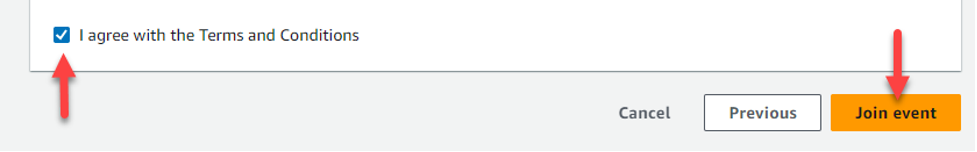
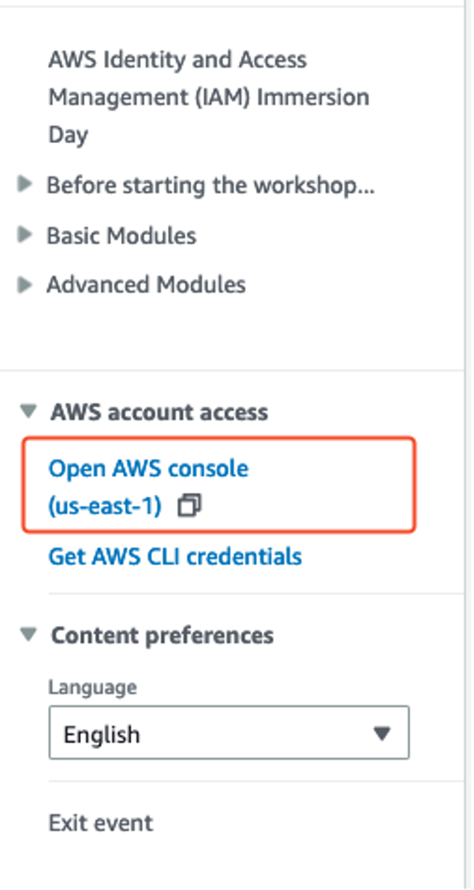

In the following steps, we will create a data quality job in AWS glue that will check our records against to 54 data quality rules.

When the job executes it will output the records in 2 different tables. Successful records will be sent to a table that the data-analysts can query immediatly and failed records will be sent to seperate table to be addressed by data owners.

  

1. In the AWS Glue Console click on Visual ETL.

2. Select Visual with a blank canvas and click on create

Turn off the new UI by clicking the toggle button shown in screenshot below.

3. Name your job dg_workshop_dq 

4. Click on Source and select AWS Glue Data Catalog

5. Click on data catalog node and select insurancedb for database and select the claims table 

6. Let’s add our data quality evaluation action. Click on action drop down located above the canvas and select Evaluate Data Quality

7. Select the newly created Evaluate Data Quality node and Copy/paste the following data quality rules:

Note: These rules were auto-recommended by AWS Glue Data Quality engine via rule recommendation feature within Glue Catalog. However, this feature is not yet added to the lab test accounts used for today but should be available within your organization’s AWS accounts. When the rules are autogenerated you have the ability to edit them before implementation. For example in this lab we updated ColumnValues "age" between 0 and 100 to ColumnValues "age" between 16 and 100 as the minimum legal age to drive in the US is 16 years old.

Rules = [
    IsComplete "weekofmonth",
    ColumnValues "weekofmonth" <= 5,
    IsComplete "dayofweek",
    ColumnValues "dayofweek" in ["Friday", "Sunday", "Saturday", "Wednesday", "Thursday", "Tuesday", "Monday"],
    ColumnLength "dayofweek" between 5 and 10,
    IsComplete "make",
    ColumnValues "make" in ["Toyota", "Rivian", "BMW", "Kia", "Audi", "Tesla", "Honda", "Chevrolet", "Mazda", "Ford", "Accura"],
    ColumnLength "make" between 2 and 10,
    IsComplete "accidentarea",
    ColumnValues "accidentarea" in ["Urban", "Rural"],
    ColumnLength "accidentarea" = 5,
    IsComplete "dayofweekclaimed",
    ColumnValues "dayofweekclaimed" in ["Saturday", "Thursday", "Tuesday", "Monday", "Friday", "Sunday", "Wednesday"],
    ColumnLength "dayofweekclaimed" between 5 and 10,
    IsComplete "monthclaimed",
    ColumnValues "monthclaimed" in ["January", "July", "September", "October", "June", "August", "November", "April", "December", "May", "March", "February"],
    ColumnLength "monthclaimed" between 2 and 10,
    IsComplete "weekofmonthclaimed",
    ColumnValues "weekofmonthclaimed" <= 5,
    IsComplete "sex",
    ColumnValues "sex" in ["Female", "Male"],
    ColumnLength "sex" between 3 and 7,
    IsComplete "maritalstatus",
    ColumnValues "maritalstatus" in ["Single", "Married"],
    ColumnLength "maritalstatus" between 5 and 8,
    IsComplete "age",
    ColumnValues "age" between 16 and 100,
    IsComplete "vehiclecategory",
    ColumnValues "vehiclecategory" in ["Compact", "Cross-over SUV", "Sport", "SUV", "Sedan", "Truck", "Mini-van", "Mid-size Sedan", "Utility"],
    ColumnLength "vehiclecategory" between 2 and 15,
    IsComplete "fraudfound",
    ColumnValues "fraudfound" in ["0", "1"],
    ColumnValues "fraudfound" <= 1,
    IsComplete "policynumber",
    ColumnValues "policynumber" <= 10000,
    IsComplete "repnumber",
    IsComplete "deductible",
    ColumnValues "deductible" in ["500", "1000", "5000", "3000", "300"],
    IsComplete "driverrating",
    ColumnValues "driverrating" in ["4", "3", "2", "1", "5"],
    ColumnValues "driverrating" <= 5,
    IsComplete "days_policy_accident",
    ColumnValues "days_policy_accident" in ["More than 30", "15-to-30"],
    ColumnLength "days_policy_accident" between 7 and 13,
    IsComplete "days_policy_claim",
    ColumnValues "days_policy_claim" in ["15-to-30", "More than 30"],
    ColumnLength "days_policy_claim" between 7 and 13,
    IsComplete "pastnumberofclaims",
    IsComplete "ageofvehicle",
    ColumnValues "ageofvehicle" in ["3 years", "4 to 6 years", "less than 3 year", "More than 6 years"],
    ColumnLength "ageofvehicle" between 6 and 18,
    IsComplete "policereportfiled",
    ColumnValues "policereportfiled" in ["Yes", "No"],
    ColumnLength "policereportfiled" between 1 and 4
]

8. These rules will:

1)	Ensure that we have no records with null values 
ie. IsComplete "weekofmonth"
2)	Ensure strings match specific values 
ie. ColumnValues "accidentarea" in ["Urban", "Rural"]
3)	Ensure we have a range for column lengths 
ie. ColumnLength "dayofweek" between 5 and 10
4)	Ensure integer values are within a specific range 
ie. ColumnValues "age" between 16 and 100,

Scroll down to “Data quality transform output” section. When bad quality data is detected due to failed rules, we like to know which source records passed vs failed and for what rule. 

To accomplish this, select the checkbox “Original Data” and enable the toggle button “Add new columns to indicate data quality errors” shown in screenshot below. 

9. Above steps adds a new node on your canvas with the name rowLevelOutcomes. Click on the node and select the tab ‘Output Schema’ on the right hand pane. Scroll all the way down to notice the 4 audit columns added. 

DataQualityRulesPass: Identifies records that have passed data quality checks

DataQualityRulesFail: Identifies records that have failed data quality checks and the attribute that failed 

DataQualityRulesSkip: Some rule types such as row count are not applied at individual
record level. This will show pass or fail

ataQualityEvaluationResult: This identifies the overall data quality result

10. Click back on Evaluate Data Quality node and select the Data quality results box, this will add a new node called ruleOutcomes to capture the cloudwatch logs and data quality rule metrics.

Select from the drop down list under “Data quality Actions”, default configurations shows in screenshot below to let the job continue and complete when one or more data quality rules have failed. 
 

11. Lets write the rule metrics into an S3 bucket to allow further actions such as building dashboard to monitor data quality over time.

From your Canvas, select the node ruleOutcomes and click on the dropdown tab Target. Then select Amazon S3.

12. Select your S3 bucket using the Browse S3 button and append to the path ‘/metricout/’ as shown in screenshot below

13. Let's filter out data quality rule passed and failed records using ‘Conditional Router” transform. On your canvas, select the node named ‘rowLevelOutcomes’, click on the Action drop down tab on top of the canvas and select Conditional Router as showin in screenshot below.

Select rowLevelOutcomes node
Click on Action and select Conditional Router.

14. We route all failed records to group named Failed_records group and let all good quality records to default_group
On the right hand pane under Transform tab, rename ‘Group name” from output_group_1 to “Failed_records” and select the radio button logical operator AND. 

15. We filter on the audit column ‘DataQualityEvaluationResult’

Select from the key dropdown, Key: DataQualityEvaluationResult and for Value, add ‘Failed’

16. Now lets write the records that passed all data quality rules into a pre-created table for this lab named "pass" and all failed records to another pre-table named "fail”

a)	On your canvas, select the node named ‘Default_group’ which has all passed records and click on the drop down tab Target, at the top of the canvas. 
Now select the target with name AWS Glue Data Catalog
On the right hand pane in first tab, select from Database dropdown, ‘Insurancedb’ and Table dropdown ‘pass’.

b)	Now lets repeat the steps for failed records by selecting the node named ‘Failed_Records’ on your canvas and click the drop down tab named Target at the top of the canvas. 

Now select the target with name AWS Glue Data Catalog
On the right hand pane in first tab, select from Database dropdown, ‘Insurancedb’ and Table dropdown ‘fail’.

17. Glue Studio will automatically generate the code that you can view you can easily take this code parameterize it and reuse the same job for different data sources and data
quality rules thus reducing your overall development time. 

    a)  On the top banner click on Script and inspect the job script
        

    b)  Click on Job details and select the GlueWorkshopRole
          

    c)  Now let's save and run this job
        

18. You can monitor the job execution by clicking on the Run tab of the top banner 
The job should complete successfully

19. Let's check the data quality result 

Click on the data quality tab. As you can see the data quality failed and the score is 96% for quality with 2 rules that failed.

We see that Rule_19 ColumnValues "weekofmonthclaimed" <= 5 and Rule_27 ColumnValues "age" between 16 and 100 failed

20. Let’s now inspect our failed records output with Athena

Search for the Athena service in the search bar and click on Athena

21. In the Athena query editor first we need to setup our query results S3 bucket

    a) click on the edit settings button
    

    b) Enter the S3 path to the query results folder: 
    s3://dg-workshop-AWSACCOUNT#/athena-results/
    

22. select the insurancedb and run the following query:

SELECT * FROM "insurancedb"."fail" limit 10;

23. If we inspect the results we can see which data quality rule failed for each record. In the below example we see that the [ColumnValues "weekofmonthclaimed" <= 5] has failed, if we take a look at the "weekofmonthclaimed" value for this record it equals 7. 

We have successfully captured these failed records and we can now notify the source systems owners so they can correct the data.

 

